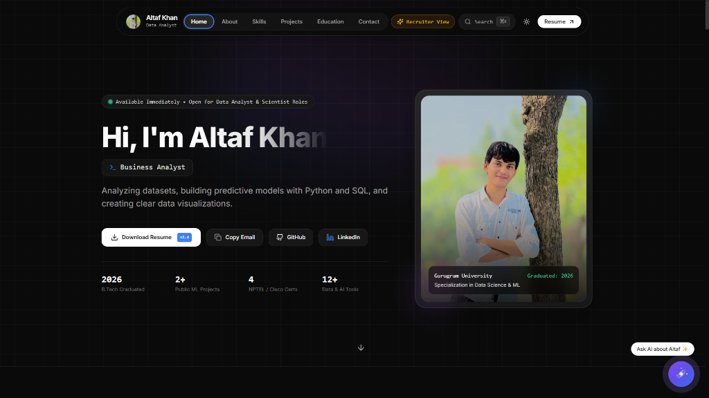
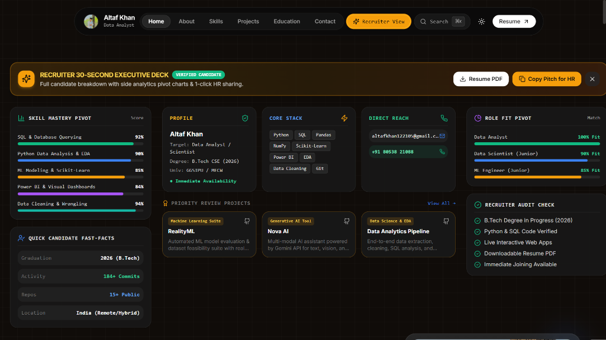
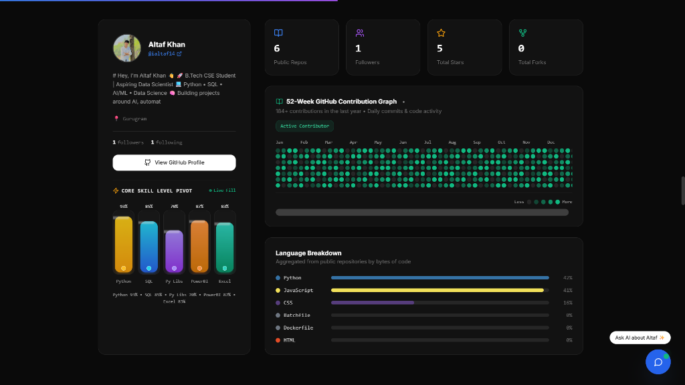
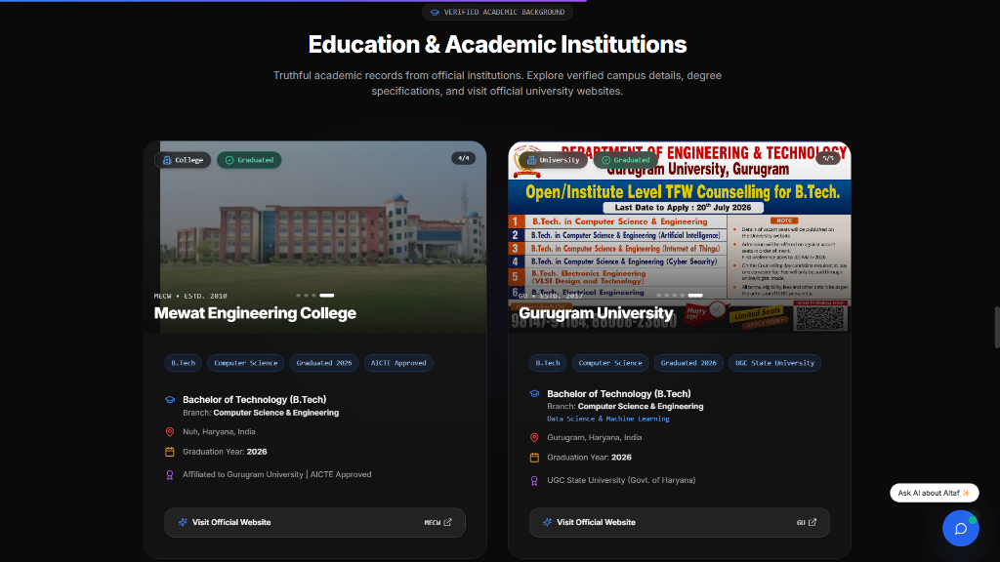
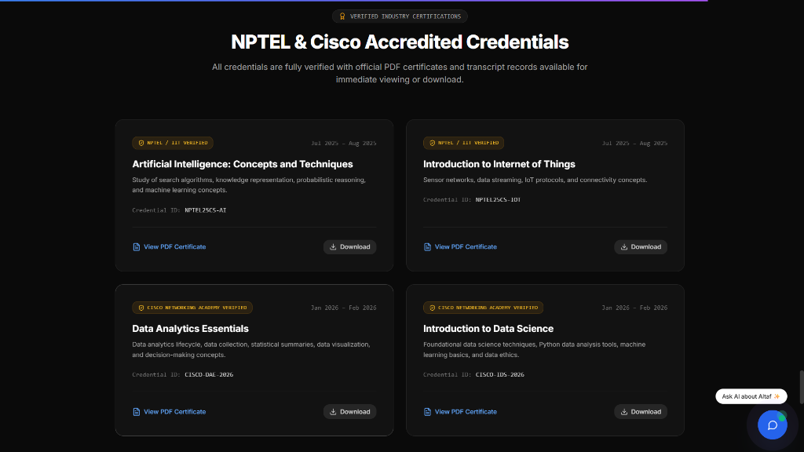
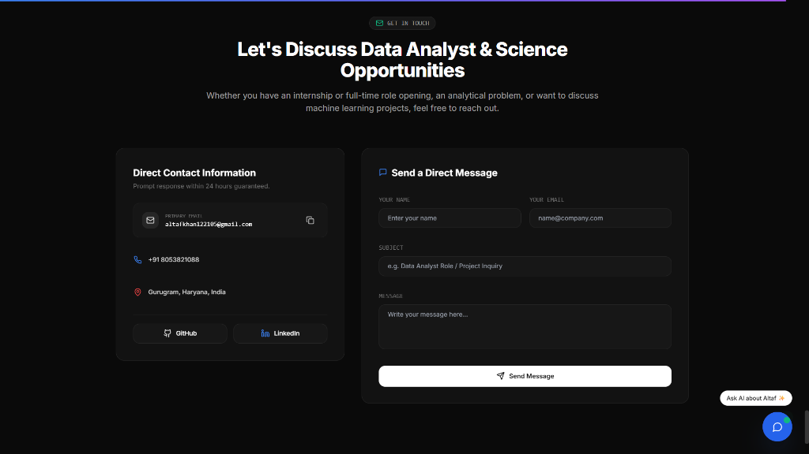

# 📊 Altaf Khan — Data Analyst & Data Scientist Portfolio

> Personal portfolio website of **Altaf Khan** — B.Tech Computer Science & Engineering (Class of 2026), Mewat Engineering College, Nuh, Haryana, affiliated with Gurugram University.

[](https://react.dev/)
[](https://tailwindcss.com/)
[](https://www.framer.com/motion/)
[](https://docs.github.com/en/rest)
[](https://craco.js.org/)
[](LICENSE)

---

## 📸 Screenshots

### ⚡ Hero Landing Section


### 🎯 Recruiter View — 30-Second Executive Deck


### 📊 GitHub Stats + Core Skill Level Pivot Chart


### 🎓 Education & Academic Institutions


### 🏆 NPTEL & Cisco Accredited Certifications


### ✉️ Contact Section


---


## 🎯 Overview

This is the personal portfolio of **Altaf Khan**, a Data Analyst & Data Scientist targeting roles in Data Analytics, Data Science, and ML Engineering. The portfolio showcases real-world Python, SQL, Machine Learning, and Power BI projects, GitHub activity, certifications, and educational background.

**Target Roles:** Data Analyst · Data Scientist · ML Engineer

**Core Skills:** Python (93%) · SQL (85%) · Power BI (87%) · Excel (83%) · Python Libraries (70%)

---

## 🌟 Key Features

| Feature | Description |
|---------|-------------|
| ⚡ **Command Palette** | `Ctrl+K` / `Cmd+K` — Instant search across sections, projects, certs, and commands |
| 🤖 **AI Chatbot** | Built-in AI assistant trained on Altaf's resume & projects |
| 🌙 **Dark / Light Mode** | Persistent theme toggle with system preference support |
| 📊 **GitHub API Integration** | Auto-fetches live repos, READMEs, tech stacks & language stats |
| 🎯 **Recruiter View Mode** | 30-second executive summary with skill mastery & role-fit pivot charts |
| 💬 **Floating Contact Button** | Morphs into AI chatbot on hover (2.5s), WhatsApp & Email quick-links |
| 📈 **Skill Ball Pivot Chart** | Physics ball-drop animation filling skill columns by proficiency % |
| 🏆 **Certifications Viewer** | NPTEL (IIT) & Cisco certs with inline PDF preview & download |
| 📱 **Fully Responsive** | Mobile-first design, works on all screen sizes |

---

## 🛠️ Tech Stack

```
Portfolio
├── Core Framework   → React 19 + React Router DOM v7
├── Build Tool       → CRACO (Create React App Config Override)
├── Styling          → Tailwind CSS v3 + custom CSS (glass.css)
├── Animations       → Framer Motion v11
├── Icons            → Lucide React v0.507
├── UI Components    → Radix UI primitives (shadcn/ui patterns)
├── Theme System     → Custom ThemeContext (dark/light/system)
├── State            → React Context API (ThemeContext, RecruiterContext)
└── Data Fetching    → GitHub REST API v3 via Axios
```

---

## 📁 Project Structure

```
Portfolio/
├── public/
│   ├── certificates/          # Accredited PDF certificates (NPTEL, Cisco)
│   ├── cv/                    # Resume PDF (Altaf_Khan_CV.pdf)
│   └── images/                # Profile photo, project screenshots
├── src/
│   ├── components/            # Page section components
│   │   ├── About.js           # About section
│   │   ├── Certifications.js  # Certificates viewer
│   │   ├── Contact.js         # Contact form + social links
│   │   ├── Education.js       # Education + timeline
│   │   ├── Footer.js          # Site footer
│   │   ├── GitHubProjects.js  # Live GitHub repo cards
│   │   ├── GitHubStats.js     # GitHub contribution graph + stats
│   │   ├── Header.js          # Floating pill navbar + mobile drawer
│   │   ├── Hero.js            # Landing hero section + Recruiter View host
│   │   ├── LearningTimeline.js# Learning journey timeline
│   │   ├── Portfolio.js       # Root layout component
│   │   ├── Skills.js          # Skills section
│   │   └── ui/                # UI component library
│   │       ├── AIChatbot.jsx          # AI Chatbot window
│   │       ├── CommandPalette.jsx     # Ctrl+K command palette
│   │       ├── FloatingContactButton.jsx # Floating contact/AI button
│   │       ├── RecruiterViewDeck.jsx  # Recruiter mode pivot layout
│   │       ├── SkillBallPivotChart.jsx# Physics ball chart
│   │       ├── ImageLightbox.jsx      # Fullscreen image viewer
│   │       ├── RepoDetailModal.jsx    # GitHub repo detail modal
│   │       └── ...                   # Radix UI / shadcn primitives
│   ├── contexts/
│   │   ├── ThemeContext.js    # Dark/light theme provider
│   │   └── RecruiterContext.jsx # Recruiter mode global toggle
│   ├── config/                # GitHub API config (username, token)
│   ├── data/                  # Static profile data (mockData.js)
│   ├── hooks/                 # Custom React hooks (GitHub API)
│   ├── services/              # GitHub API client & caching logic
│   ├── lib/                   # Utility functions
│   ├── App.js                 # App root with routing & providers
│   ├── index.js               # React entry point
│   ├── index.css              # Global CSS + Tailwind directives
│   └── glass.css              # Glassmorphism header styles
├── .env                       # GitHub API token (NOT committed)
├── .gitignore
├── craco.config.js            # CRACO webpack override
├── tailwind.config.js         # Tailwind configuration
├── postcss.config.js
├── package.json
├── start.bat                  # Windows dev server launcher
└── README.md
```

---

## 🚀 Local Setup

### Prerequisites

- **Node.js** v18+ ([Download](https://nodejs.org/))
- **npm** v9+ (comes with Node.js)
- **Git** ([Download](https://git-scm.com/))

### 1. Clone the Repository

```bash
git clone https://github.com/ialtaf14/Portfolio.git
cd Portfolio
```

### 2. Install Dependencies

```bash
npm install --legacy-peer-deps
```

> ⚠️ Use `--legacy-peer-deps` flag to resolve React 19 peer dependency conflicts.

### 3. Configure GitHub API Token (Optional but Recommended)

Create a `.env` file in the project root:

```env
REACT_APP_GITHUB_TOKEN=your_github_personal_access_token_here
REACT_APP_GITHUB_USERNAME=ialtaf14
```

> Without a token, GitHub API is rate-limited to 60 requests/hour. With a token: 5000/hour.

### 4. Start Development Server

**Windows (double-click or run):**
```bat
start.bat
```

**All platforms:**
```bash
npm start
```

Opens at → [http://localhost:3000](http://localhost:3000)

### 5. Production Build

```bash
npm run build
```

Output goes to `/build` folder. Ready for deployment on Vercel, Netlify, or GitHub Pages.

---

## ⚙️ Environment Variables

| Variable | Required | Description |
|----------|----------|-------------|
| `REACT_APP_GITHUB_TOKEN` | Optional | GitHub Personal Access Token for higher API rate limits |
| `REACT_APP_GITHUB_USERNAME` | Optional | GitHub username (default: `ialtaf14`) |

> **Never commit your `.env` file.** It is already listed in `.gitignore`.

---

## 🎨 Design System

- **Font:** Inter (Google Fonts)
- **Color Mode:** Dark (default) / Light — persisted in `localStorage`
- **Glassmorphism:** Frosted glass navbar using `backdrop-blur` + custom CSS
- **Motion:** Framer Motion spring animations, micro-interactions, layout animations
- **Responsiveness:** Mobile-first, breakpoints: `sm` (640px), `lg` (1024px), `xl` (1280px)

---

## 📦 Key Dependencies

| Package | Version | Purpose |
|---------|---------|---------|
| `react` | ^19.0.0 | Core UI framework |
| `react-router-dom` | ^7.5.1 | Client-side routing |
| `framer-motion` | ^11.15.0 | Animations & transitions |
| `lucide-react` | ^0.507.0 | Icon library |
| `axios` | ^1.8.4 | HTTP client for GitHub API |
| `tailwindcss` | ^3.4.17 | Utility-first CSS |
| `@craco/craco` | ^7.1.0 | CRA config override (Webpack) |
| `@radix-ui/*` | various | Accessible UI primitives |
| `clsx` + `tailwind-merge` | latest | Conditional class utilities |
| `cmdk` | ^1.1.1 | Command palette primitive |
| `date-fns` | ^3.6.0 | Date formatting |

---

## 🚢 Deployment

### Vercel (Recommended)

```bash
# Install Vercel CLI
npm i -g vercel

# Deploy
vercel
```

### Netlify

Drag & drop the `/build` folder on [Netlify Drop](https://app.netlify.com/drop) after running `npm run build`.

### GitHub Pages

Add `"homepage": "https://ialtaf14.github.io/Portfolio"` to `package.json`, then:
```bash
npm install --save-dev gh-pages
npm run build
npx gh-pages -d build
```

---

## ✉️ Contact

| Platform | Link |
|----------|------|
| 📧 Email | [altafkhan122105@gmail.com](mailto:altafkhan122105@gmail.com) |
| 💼 LinkedIn | [altaf-khan-7a544b256](https://www.linkedin.com/in/altaf-khan-7a544b256/) |
| 🐙 GitHub | [@ialtaf14](https://github.com/ialtaf14) |
| 📱 WhatsApp | [+91 80538 21088](https://wa.me/918053821088) |
| 📍 Location | Gurugram, Haryana, India |

---

© 2026 Altaf Khan. Built with React 19, Tailwind CSS & Framer Motion.